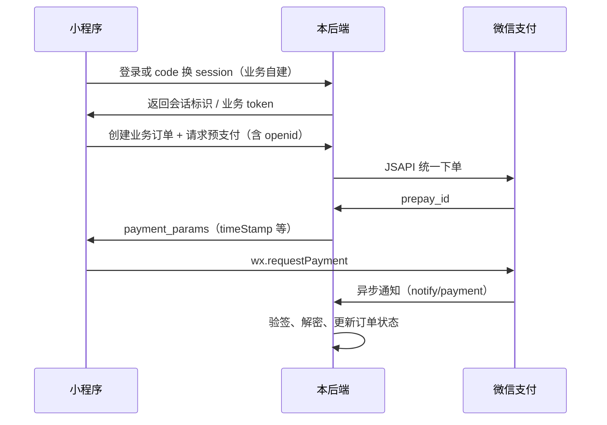

# 微信支付 JSAPI / 小程序接入指南

本文档说明如何在基于本模板的后端中接入 **微信支付 API v3（JSAPI 统一下单）**，并在后续接入 **微信小程序** 时的完整流程与配置要求。

---

## 1. 能力说明

本模板在 `backend/app/services/wechat_pay/` 中内置微信支付 v3 SDK，并在 `POST /api/v1/wechat-pay/prepay` 等接口中提供示例实现。

- **JSAPI 支付**：在微信内置浏览器打开的网页（公众号 H5）中调起支付。
- **小程序支付**：小程序侧仍使用同一套 **JSAPI 统一下单** 接口得到 `prepay_id`，再通过 `wx.requestPayment` 调起收银台；openid 必须为该小程序 AppID 下的用户标识。

二者后端下单路径一致，区别主要在客户端获取 openid 的方式。

---

## 2. 接入前在微信侧需完成的准备工作

在填写后台配置项之前，通常需要在微信商户平台 / 公众平台完成：

1. **开通微信支付**，获取 **商户号（mchid）**。
2. 将 **小程序（或公众号）AppID** 与商户号 **绑定**（商户平台 → 产品中心 → AppID 账号管理）。
3. 申请 **API v3**，设置 **API v3 密钥**，下载 **商户 API 证书**，记录 **证书序列号**。
4. 按微信支付文档下载 **微信支付平台公钥** 及对应的 **公钥 ID**（用于验签回调与应答）。
5. 确保服务端部署域名可使用 **HTTPS**，以便配置可被微信访问的 **支付回调 URL**。

模板不提供微信侧的图文教程；请以 [微信支付商户文档](https://pay.weixin.qq.com/doc/v3/merchant/4013070756.md) 为准。

---

## 3. 配置项说明（系统设置 → 微信支付）

所有配置项通过管理后台 **「系统设置 → 配置项管理 → 微信支付」** 分组维护（种子数据定义于 `backend/app/core/config.py` 的 `SETTINGS_BOOTSTRAP_ITEMS`）。

### 3.1 必填配置项（缺一不可）

以下八项若缺失或错误，将导致 **统一下单失败、签名失败或回调无法解密**。

| 配置键（setting_name） | 含义 |
|--------------------------|------|
| `wechat_pay_app_id` | 与商户号绑定的 **小程序或公众号 AppID**（与下单时使用的 appid 一致）。 |
| `wechat_pay_mch_id` | 微信支付 **商户号**。 |
| `wechat_pay_api_v3_key` | **API v3 密钥**（32 字节字符串），用于解密回调通知中的加密资源。标记为敏感且加密存储。 |
| `wechat_pay_cert_serial` | 商户 API 证书的 **序列号**，用于请求头 `Authorization` 中的 `serial_no`。 |
| `wechat_pay_private_key` | 商户 API 证书的 **私钥 PEM** 全文。用于请求签名及生成小程序调起支付的 `paySign`。标记为敏感且加密存储。 |
| `wechat_pay_public_key_id` | 微信支付 **平台公钥 ID**，对应应答头 `Wechatpay-Serial` 等校验场景。 |
| `wechat_pay_public_key` | 微信支付 **平台公钥 PEM** 全文，用于校验微信支付应答签名及回调通知签名。标记为敏感且加密存储。 |
| `wechat_pay_notify_base_url` | **回调通知基础 URL**（协议 + 域名，可选端口；不含 `/api/v1` 路径）。下文说明如何拼出完整回调地址。 |

### 3.2 `wechat_pay_notify_base_url` 如何填写

模板代码会用该值拼接异步通知地址（见 `app/api/routes/wechat_pay.py`）：

- 支付结果：`{wechat_pay_notify_base_url}/api/v1/wechat-pay/notify/payment`
- 退款结果：`{wechat_pay_notify_base_url}/api/v1/wechat-pay/notify/refund`

示例：若服务对外地址为 `https://pay.example.com`，则配置：

```text
wechat_pay_notify_base_url = https://pay.example.com
```

不要包含路径 `/api/v1`（已由代码追加）；末尾斜杠可有可无，加载时会规范化。请确保该 HTTPS 主机可从公网访问；本地开发可使用内网穿透将上述路径映射到本机。

---

## 4. 后端 API 一览（参考）

基础路径：`/api/v1/wechat-pay/`（完整 URL 前缀取决于部署，一般为 `https://你的域名/api/v1/wechat-pay/`）。

| 方法 | 路径 | 说明 |
|------|------|------|
| POST | `/prepay` | JSAPI 统一下单，返回 `payment_params`（供 `wx.requestPayment` 使用）。当前模板要求 **Bearer JWT**（见下文小程序对接）。 |
| POST | `/notify/payment` | 微信支付异步通知（**勿**带应用 JWT；验签依赖 HTTP 头）。 |
| POST | `/notify/refund` | 退款异步通知。 |
| GET | `/orders/{out_trade_no}` | 按商户订单号查单。 |
| POST | `/orders/{out_trade_no}/close` | 关单。 |
| POST | `/refunds` | 发起退款。 |

OpenAPI 文档中可能隐藏回调路由；以源码 `app/api/routes/wechat_pay.py` 为准。

---

## 5. 后续接入微信小程序时的推荐流程

### 5.1 整体时序



### 5.2 获取 openid（必做）

小程序支付下单参数中的 `payer.openid` 必须是 **当前用户在小程序 AppID 下的 openid**，不能使用公众号或其它 AppID 的 openid。

常见做法：

1. 小程序调用 `wx.login()` 取得 **临时登录凭证 `code`**。
2. 将 `code` 发到 **你自己的后端**，后端调用微信 `code2Session`（需小程序 **AppSecret**，务必只放在服务端）。
3. 后端得到 **openid**（及可选 session_key），与自己的用户体系绑定后返回前端会话或 JWT。

本模板 **未内置** `code2Session` 路由；接入小程序时需在业务项目中新增接口，并妥善保管 AppSecret。

### 5.3 调用预支付接口 `POST /api/v1/wechat-pay/prepay`

请求头：`Authorization: Bearer <access_token>`（与现有管理后台一致）。

请求体字段（与 `PrepayRequestBody` 一致）：

| 字段 | 说明 |
|------|------|
| `out_trade_no` | 商户侧订单号，6–32 字符，商户号内唯一。 |
| `description` | 商品描述（用户账单可见）。 |
| `total_amount` | 总金额，**单位：分**。 |
| `openid` | 小程序用户在该小程序 AppID 下的 openid。 |
| `attach` | 可选，附加数据，回调原样带回。 |
| `time_expire` | 可选，支付结束时间（RFC3339）。 |

响应中的 `payment_params`（类型 `WxPaymentParams`）JSON 使用微信侧字段名：`timeStamp`、`nonceStr`、`package`、`signType`、`paySign`，可直接解构给 `wx.requestPayment`（路由已启用 `response_model_by_alias=True`）。

小程序示例（需在用户点击支付等时机调用）：

```javascript
const res = await wx.requestPayment({
  timeStamp: params.timeStamp,
  nonceStr: params.nonceStr,
  package: params.package,
  signType: params.signType,
  paySign: params.paySign,
})
// success 仅表示流程走完；业务状态以服务端回调与查单为准
```

若希望 **小程序用户免登录管理后台 JWT**，可在业务项目中新增专用路由（例如使用小程序 token 或签名验证），内部仍调用 `app.services.wechat_pay` 中已有函数即可。

### 5.4 支付结果以何为准

- **`wx.requestPayment` 的 success 回调不能作为入账依据**（用户可能断网、异常退出）。
- 应以 **异步通知** `notify/payment` 中的解密结果，或主动 **查单** `GET /wechat-pay/orders/{out_trade_no}` 为准。
- 模板在回调处理函数中预留了 `# >>> YOUR BUSINESS LOGIC <<<`，请在业务项目中写入：更新订单状态、发货、记账等。

---

## 6. 安全与运维提示

1. **密钥与 PEM** 仅出现在后台配置与服务器环境，不要写入小程序代码或前端仓库。
2. 回调接口已通过 `audit_log_exempt` 避免将敏感报文写入审计日志；业务日志中也不要打印完整密钥或明文卡信息。
3. 生产环境务必使用 **HTTPS** 与正确配置的 **notify_base_url**。
4. 若更换证书或 API v3 密钥，需同步更新对应配置项。

---

## 7. 相关源码位置

| 模块 | 路径 |
|------|------|
| SDK 包 | `backend/app/services/wechat_pay/` |
| HTTP 路由 | `backend/app/api/routes/wechat_pay.py` |
| 默认配置种子 | `backend/app/core/config.py` → `SETTINGS_BOOTSTRAP_ITEMS` |
| 运行时读取配置 | `backend/app/core/runtime_settings.py` |

---

## 8. 常见问题

**Q：提示 APPID 与 mchid 不匹配？**  
A：检查商户平台是否已绑定该 AppID，且 `wechat_pay_app_id` 与小程序实际 AppID 一致。

**Q：回调收不到？**  
A：检查 `wechat_pay_notify_base_url` 是否公网可达、路径是否为 `/api/v1/wechat-pay/notify/payment`，防火墙与负载均衡是否转发 POST 与原始 Body。

**Q：验签失败？**  
A：核对平台公钥与 `wechat_pay_public_key_id` 是否为同一组；API v3 密钥是否正确。

---

更通用的开发与部署说明见 [开发指南](development.md) 与 [部署指南](deployment.md)。
